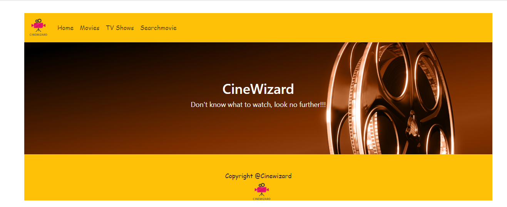
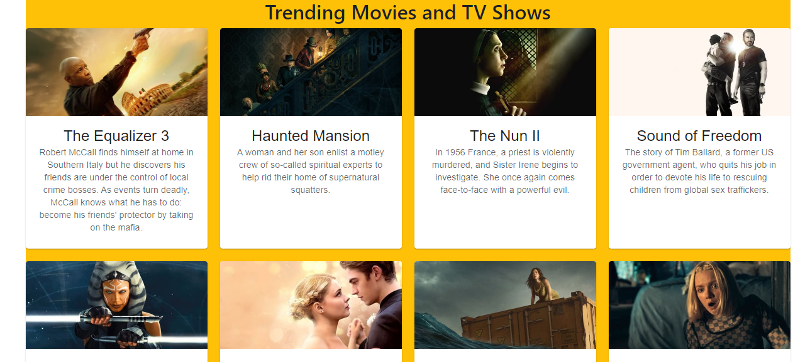
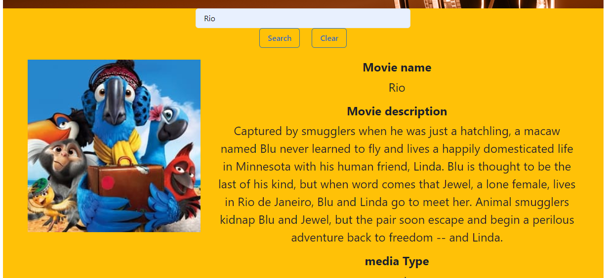

# Cinewizard
The motivation for developing CineWizard is to create a user-friendly platform for movie and TV show enthusiasts. With the vast amount of content available today, users often struggle to find something to watch that matches their preferences. .
## Link to github repository
        https://github.com/Harpreet17594/cinewizard
## Link to Deployed application
        https://651e71846f84255385d32cab--legendary-manatee-17c7aa.netlify.app/
---
## Table of Contents
[--> About cinewizard](#about-me)
[--> Languages used](#5-languages-used)
[--> Browser Support](#6-browser-support)
[--> Screenshots](#7-screenshots-of-webpage)
[--> Installation](#8-installation)
[-->Contribution](#9-contribution)
[-->License](#10-license)
## 1. About cinewizard
        
     Project Description: Cinewizard is a single-page application that provides users with in depth information about movies and tv-shows, such as storyline, rating, cast, certificate, genres. One other feature, allows users to search for titles by specific criteria, such as genre, release date, or director. This makes it easy for users to find movies that match their preferences.
    Motivation: CineWizard aims to solve this problem by offering a comprehensive database of movies and TV shows, along with powerful filtering options.
    Users can easily discover new titles, create a watchlist, and access detailed information about each title, making their viewing experience more enjoyable.
## 4. Languages used

## 5. Browser support

## 6. Screenshots of webpage

## 7. Installation
        No installation required
## 8. Contribution
       There are 4 contributor of this project
       * Ricardo Oliveira
       * Mohammed ugas
       * Camila Barros
       * Harpreet kaur
## 9. License
        MIT License
